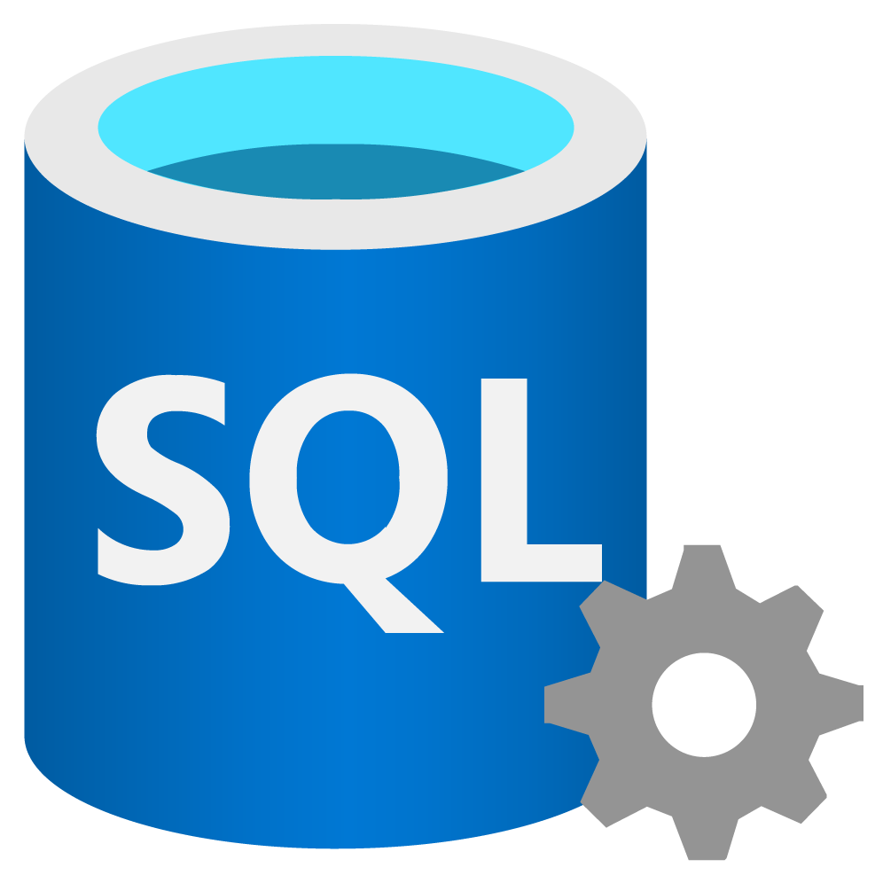

# 👩🏽‍💻 Ayrise Lima

**`Data Analyst | Business Intelligence`**

Olá! O meu nome é Ayrise sou licenciada em Gestão pela Universidade Autónoma de Lisboa. Depois de uma breve experiência em Recursos Humanos, decidi seguir um caminho mais ligado à tecnologia e análise de dados. Fiz formações em programação C/C# e Business Intelligence e, atualmente, estou a concluir o mestrado em Ciência de Dados no Politécnico de Leiria.

Durante o mestrado, participei em projetos práticos com ferramentas como SQL Server, Power BI, Python, R, MySQL, MongoDB e RPA.

Realizei um estágio de 1040 horas, onde fui responsável por criar processos de ETL em SQL Server com dados do Primavera e desenvolver dashboards e reports em Power BI. O estágio foi bastante autónomo e desafiador, tive contacto direto com a equipa para definir requisitos e, no final, o trabalho foi valorizado ao ponto de ser usado como modelo para outros clientes.

Neste repositório, partilho alguns dos projetos que desenvolvi ao longo do meu percurso. 🚀

### 🤖 Linguagens e Tecnologias

 
 

### 📊 Estatísticas

  

