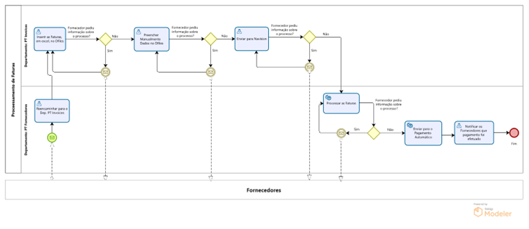
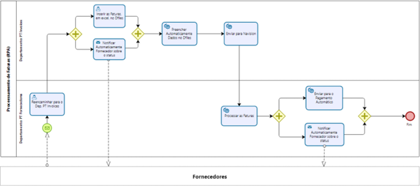
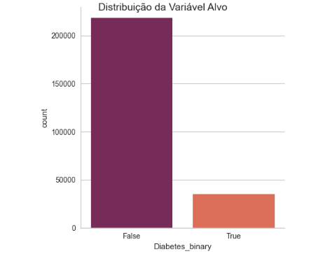
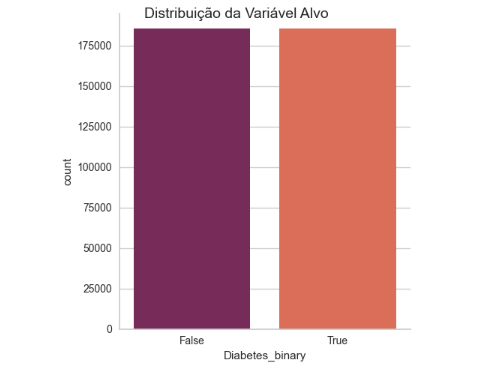
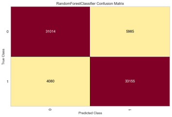
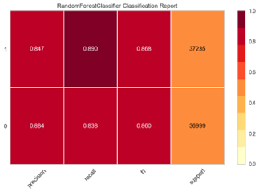
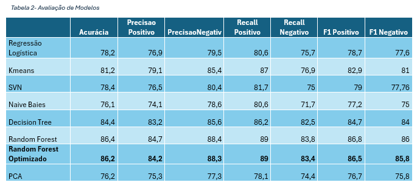

# 👩🏽‍💻 Ayrise Lima

**`Data Analyst | Business Intelligence`**

Olá! Sou a Ayrise, licenciada em Gestão e atualmente a concluir o mestrado em Ciência de Dados no Politécnico de Leiria.
Abaixo encontram-se alguns dos projetos desenvolvidos durante o estágio.
 

## Power BI Service - Estágio
### Cliente 1

  
  

  
  

  
  

 

### 📊 Cliente 2

  
  

  
  

## RPA - Automatização do Processo
### Projeto - Processamento de Faturas 

  
  

## Data Mining
### Projeto - Modelos de classificação que possam caracterizar um indivíduo relativamente à contração de Diabetes

  
  

  
  

  
  

 

